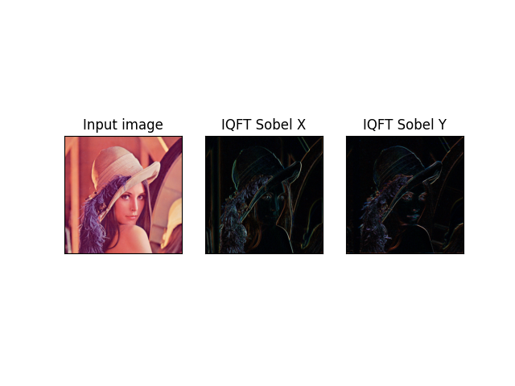
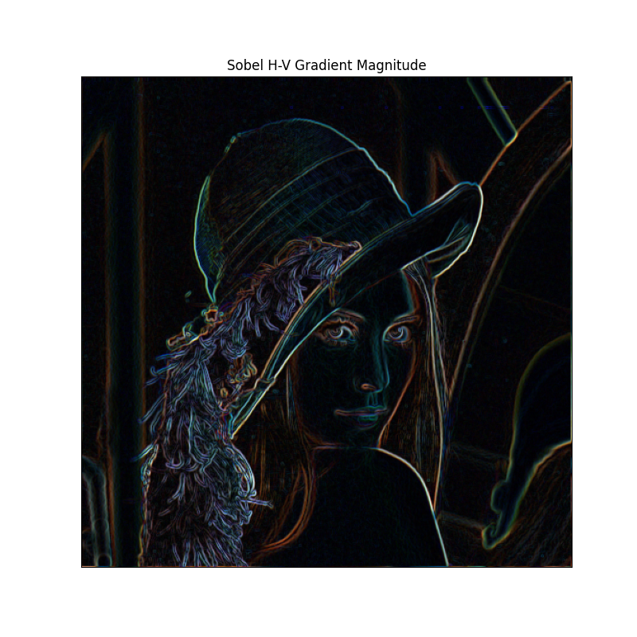

# Edge detection in color (*RGB*) images
Edge detection in color (*RGB*) images using sobel filtering and Fourier transform for Quaternions.

## Sobel horizontal and vertical

## Gradient Magnitude (Combined Sobel Horizontal and Vertical)

## Mathematical Background and Process

Traditional edge detection algorithms often convert color images to grayscale, losing critical color boundary information (e.g., a red object on a green background of the same luminance). This project preserves the color vector space by leveraging **Quaternion Mathematics**.

### 1. Color Representation using Quaternions
A quaternion is a hypercomplex number with one real part and three imaginary parts ($i, j, k$). The algorithm represents each RGB pixel as a pure quaternion, projecting the Red, Green, and Blue channels onto a pure quaternion unit axis $\mu$ (typically the gray axis $\mu = (i + j + k) / \sqrt{3}$):
$$f(x, y) = R(x,y)\mu_1 + G(x,y)\mu_2 + B(x,y)\mu_3$$

### 2. Quaternion Fourier Transform (QFT)
Instead of processing color channels in isolation, the image is transformed into the hypercomplex frequency domain using the **QFT**. The code efficiently computes this by taking standard 2D Fast Fourier Transforms (FFT) of each color channel and combining them algebraically to form the four components of the frequency-domain quaternion.

### 3. Hypercomplex Convolution (Frequency Domain Filtering)
To detect edges, we use the standard 3x3 Sobel kernels (horizontal and vertical). Instead of a spatial sliding window, these kernels are padded and transformed into the frequency domain. 
According to the **Hypercomplex Convolution Theorem**, convolution in the spatial domain is equivalent to **quaternion cross-multiplication** in the frequency domain. The code performs this cross-multiplication to apply the Sobel filters simultaneously across all color channels.

### 4. Inverse QFT and Gradient Magnitude
The filtered frequency-domain images are transformed back into the spatial domain via the **Inverse QFT (IQFT)**. Finally, the overall edge map is computed by taking the Euclidean gradient magnitude of the horizontal ($G_x$) and vertical ($G_y$) responses:
$$Magnitude = \sqrt{G_x^2 + G_y^2}$$

# References
- [1] Beijing Chen, Gouenou Coatrieux, Gang Chen, Xingming Sun, Jean Louis Coatrieux, Huazhong Shu, Full 4-D quaternion discrete Fourier transform based watermarking for color images, Digital Signal Processing, Volume 28, 2014, Pages 106-119, ISSN 1051-2004, https://doi.org/10.1016/j.dsp.2014.02.010.
- [2] Bahri, Mawardi & Ashino, R. & Vaillancourt, R.. (2013). Convolution and correlation based on discrete quaternion Fourier transform. Information (Japan). 16. 7837-7848.
